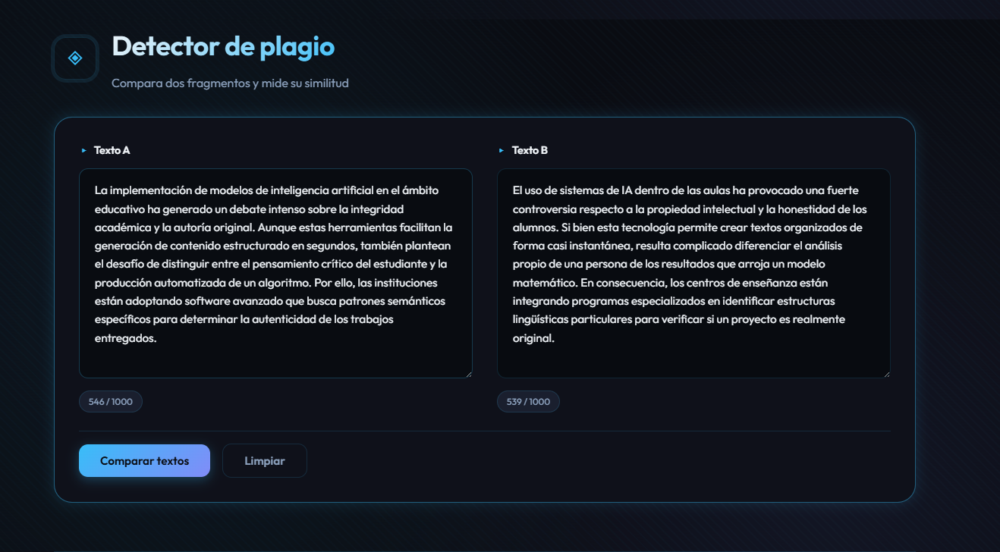
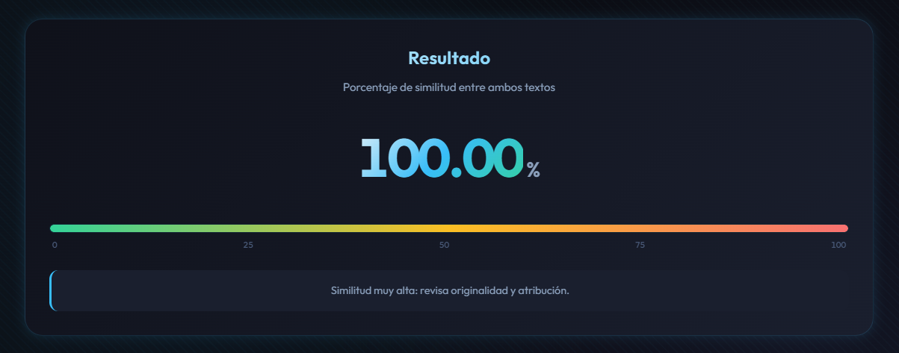

# 🔍 Detector de Plagio

## 📋 Descripción

Esta **API REST** permite analizar la similitud entre dos fragmentos de texto mediante algoritmos avanzados. Devuelve un porcentaje de coincidencia en formato **JSON** de manera clara e intuitiva, facilitando la toma de decisiones basada en datos.

## 🚀 Funcionalidades

- ✅ **Análisis comparativo:** Detecta el nivel de similitud entre dos textos.
- 📊 **Resultados precisos:** Entrega métricas en porcentaje listas para su consumo.

## 🛠 Stack Tecnológico

<div align="center">

[](https://nodejs.org/)
[](https://www.npmjs.com/)
[](https://expressjs.com/)
[](https://developer.mozilla.org/es/docs/Web/JavaScript)
[](https://www.docker.com/)

</div>

## 📖 Documentos
Accede a la guía detallada de endpoints y pruebas:
- 📘 [Manual Técnico (Markdown)](https://github.com/RitoTorri/Detector-de-Plagio/blob/master/docs/Manual.md) - Detalles de parámetros y respuestas.  
- 🚀 [Workspace de Postman](https://ritotorri-5321757.postman.co/workspace/Cortez-Jes%C3%BAs-'s-Workspace~f2d04eac-b157-4c2b-8546-4c816e6a14a8/collection/48845560-59e68cbf-ce85-432b-ae25-7424889a5fb9?action=share&creator=48845560&active-environment=48845560-3eb25b89-fab4-499d-8321-ee69fd59539c) - Pruebas interactivas de la API.  

## ⚙️ Configuracion
En la carpeta raiz del proyecto hay un archivo llamado `example.env` que contiene las variables de entorno necesarias para ejecutar el proyecto. 
Debes de cambiarle el nommbre del archivo `example.env` a `.env` y luego debes de darle valor a las variable definidas en ese archivo.

#### 🌍 Variables de entorno
`PORT`: Puerto de ejecución del servidor. Puedes cambiarlo a cualquier puerto que desees. Por defecto es `3000`.  

`API_RATE_LIMIT`: Cantidad máxima de peticiones por IP. Puedes cambiarlo a cualquier número que desees. Por defecto es `100`.  

`API_RATE_LIMIT_WINDOW`: Tiempo de bloqueo de dirección IP. Debes de cambiarlo a un número en milisegundos. Por defecto es 15 minutos (900000 milisegundos  

#### 🌍 Ejemplo de archivo `.env`
```bash
PORT=3000
API_RATE_LIMIT=100
API_RATE_LIMIT_WINDOW=900000
```

## 📦 Instalación
Ejecuta los siguientes comandos en la terminal para instalar el proyecto:

```bash
# Clonar el repositorio
git clone ttps://github.com/RitoTorri/Detector-de-Plagio

# Entrar en la carpeta del proyecto
cd Detector-de-Plagio
```

## 🚀 Ejecución e instalacion de dependecias
Este proyecto se compone de diferentes scripts para ejecutar el servidor en diferentes entornos. Desde docker hasta desarrollo local.

### 💻 Ejecucion en el entorno LOCAL

Primero instala las dependencias:
```bash
# Instalar las dependencias de producción
npm run install:prod

# Instalar las dependencias todas las dependencias
npm run install:all
```

Ejecuta el codigo de manera local:
```bash
# Ejecutar el servidor de desarrollo
npm run dev:local

# Ejecutar el servidor de producción
npm start:local

# Ejecutar los tests
npm run test
```

### 🐳 Ejecucion en el entorno de DOCKER

Este proyecto utiliza Docker exclusivamente para entornos de producción. Al no utilizar volúmenes de sincronización en tiempo real, cualquier modificación en el código fuente requiere una reconstrucción de la imagen para que los cambios sean aplicados.

Para construir la imagen desde cero y levantar el servicio, ejecuta:
```bash
# Construir la imagen de docker
npm run image:build

# ejecutar en primer plano
npm run image:run

# Ejecutar en segundo plano
docker compose up -d detector-de-plagio
```

### 📍 Ruta de acceso
Este proyecto está disponible en la siguiente ruta:
```bash
  http://localhost:3000
```

## 📖 Ejemplo de uso

<div align="center">

### 1️⃣ Paso uno: Ingresa los textos a comparar


### 2️⃣ Paso dos: Obtén el análisis de similitud

</div>

## 💡 ¿Necesitas ayuda o encontraste un error?

Si experimentas problemas con la API o consideras que la documentación puede mejorar, te invitamos a abrir un [Issue en GitHub](https://github.com/RitoTorri/Detector-de-Plagio/issues). Tu retroalimentación es fundamental para seguir mejorando este proyecto.
